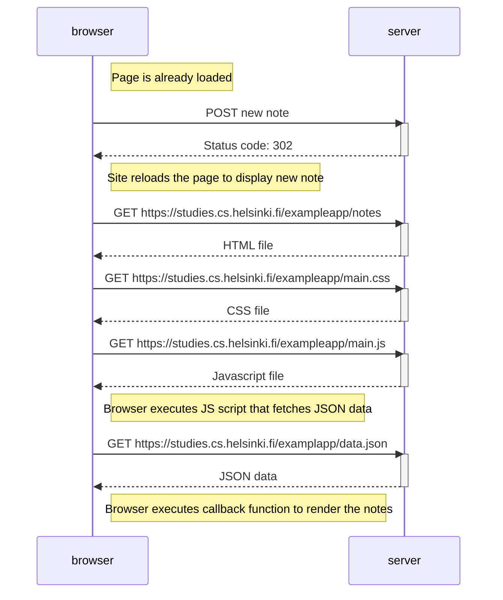

```mermaid
sequenceDiagram
    participant browser
    participant server

    Note right of browser: Page is already loaded
    browser->>server: POST new note 
    activate server
    server-->>browser: Status code: 302
    deactivate server

    Note right of browser: Site reloads the page to display new note

    browser->>server: GET https://studies.cs.helsinki.fi/exampleapp/notes
    activate server
    server-->>browser: HTML file
    deactivate server

    browser->>server: GET https://studies.cs.helsinki.fi/exampleapp/main.css
    activate server
    server-->>browser: CSS file
    deactivate server

    browser->>server: GET https://studies.cs.helsinki.fi/exampleapp/main.js
    activate server
    server-->>browser: Javascript file
    deactivate server

    Note right of browser: Browser executes JS script that fetches JSON data

    browser->>server: GET https://studies.cs.helsinki.fi/examplapp/data.json
    activate server
    server-->>browser: JSON data
    deactivate server

    Note right of browser: Browser executes callback function to render the notes
```
